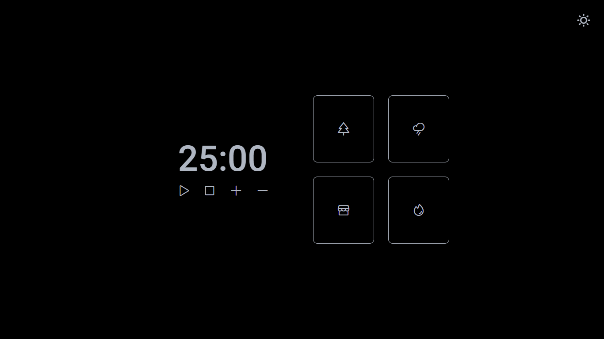
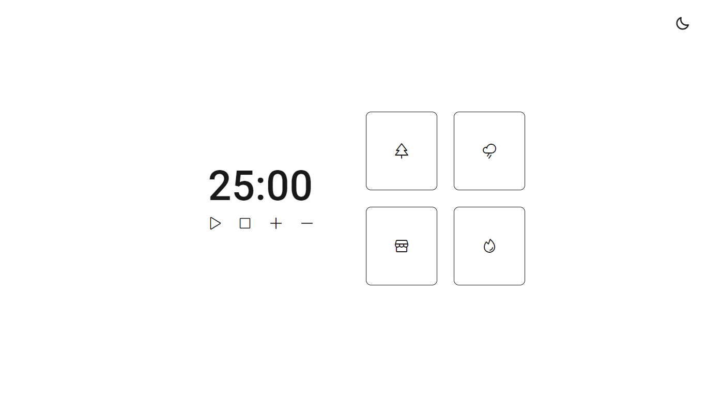
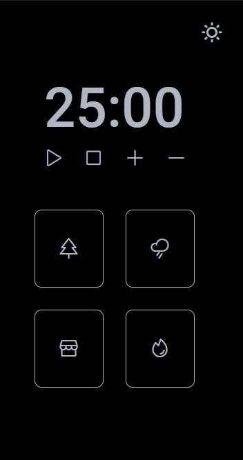
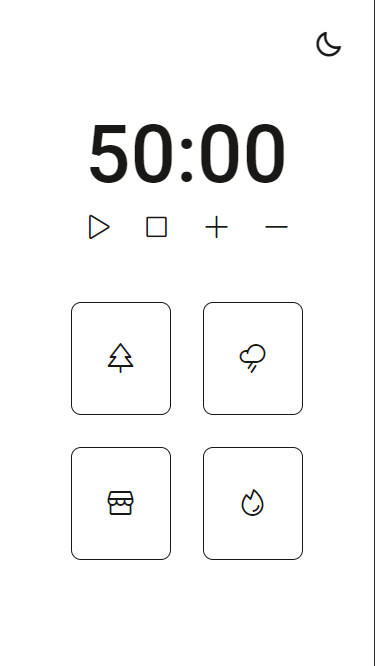

# Focus Timer

# Sobre o projeto / About the project

Neste projeto foi criado uma página responsiva de um temporizador estilo pomodoro. Há nele as funções de iniciar pausar e resetar o contador, assim como dois botões, para adicionar e remover 5 minutos no tempo quando necessário. Encontra-se também quatro botões com diferentes tipos de sons ambientes, que são de uma floresta, chuva, cafeteria e também uma lareira.

In this project we created a responsive page for a pomodoro timer. It has the functions of starting, pausing and resetting the timer, as well as two buttons for adding and removing 5 minutes from the timer when necessary. There are also four buttons with different types of ambient sounds, such as a forest, rain, coffee shop and a fireplace.

## Layout
##### Desktop

##### Mobile

# Tecnologias utilizadas / Tech stack
- HTML
- CSS
- Figma
- JavaScript

## Autor

